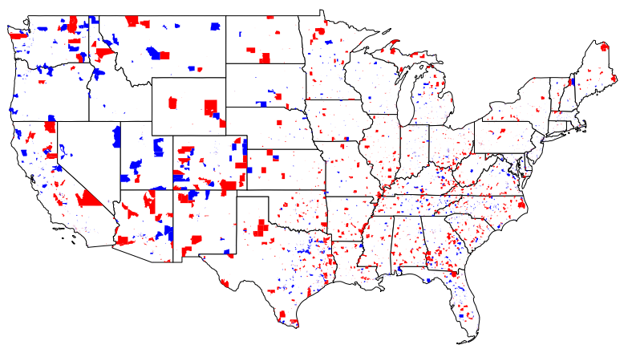

The purpose of Opportunity Zones was to create an incentive for developers to choose economically distressed communities for projects. In return, developers receive a tax break. The program was projected to cost $1.6 billion in tax revenue between 2018 and 2027, <a href = "https://taxfoundation.org/opportunity-zones-what-we-know-and-what-we-dont/">according to The Tax Foundation.</a>

Governors chose the tracts to be designated as zones. 35 million Americans live in one of these zones, <a href="https://opportunityzones.hud.gov/sites/opportunityzones.hud.gov/files/documents/OZ_One_Year_Report.pdf"> according to a Trump administration report.</a>

Critics of the program have bemoaned the fact that there is not program data available, meaning it is not possible to tell where development has actually occurred. The process of designation was also non-transparent, with zones being ultimately selected by governors, hypothetically based on a variety of indicators. <a href="https://www.propublica.org/article/superyacht-marina-west-palm-beach-opportunity-zone-trump-tax-break-to-help-the-poor-went-to-a-rich-gop-donor">Investigative news reports found the process of choosing these zones was also susceptible to political lobbying.</a> 

<i>The following map indicates where Opportunity Zones were designated across the country, with tracts that had growing population between the 2010 and 2020 Decennial Census highlighted in blue, and the opposite in red.</i>

In Michigan, while the chosen Opportunity Zones are widely spread across the state, an analysis of 2010-2019 American Community Survey data shows roughly a third of the Opportunity Zones in Michigan lie among the top quarter of fastest-growing Census tracts in the state, in terms of median household income.
  

This map showing those zones and 10 projects identified so far by the <a href = "https://eig.org/oz-activity-map">Economic Innovation Group</a> demonstrate that developers have so far favored more populace areas. Two towns with some of the most depressed zones — Flint and Saginaw — have been passed over for investments thus far, at least among those picked up by the think tank.

<iframe src="opzones_map.html" height="500" width="500"></iframe>

A small sample of 10 publicly announced Opportunity Zone investments in Michigan highlights some of the criticisms of the program. Of those 10, four lie directly within those zones that Census estimates indicate were already among the fastest growing in the state, both in population and income. A fifth in Grand Rapids is two blocks away from one of these tracts. None of these 10 projects lie within the declining Opportunity Zone tracts identified, meanwhile. 

<i>This figure shows how of these 10 publicly announced Opportunity Zone investments, many lie within the fastest <strong>growing</strong> Opportunity Zones, while none are within the fastest <strong>declining</strong> Opportunity Zone tracts most in need of an economic boost. </i>

<iframe src="opzones_map_zoom.html" height="500" width="500"></iframe>

 However, the example of downtown Detroit provides a view into how juxtaposed wealth and prosperity can be even in nearby communities, with some of the fastest-growing and fastest-declining Opportunity Zones situated directly next to each other. Whether an investment in one Opportunity Zone will benefit another zone and its community nearby is a far more subjective question.

Other subjective questions, and harder ones: Whether developers can be incentivized to build and invest in communities they don't feel will pay them back, and whether these communities' economic futures should be entrusted to the will of private companies.

